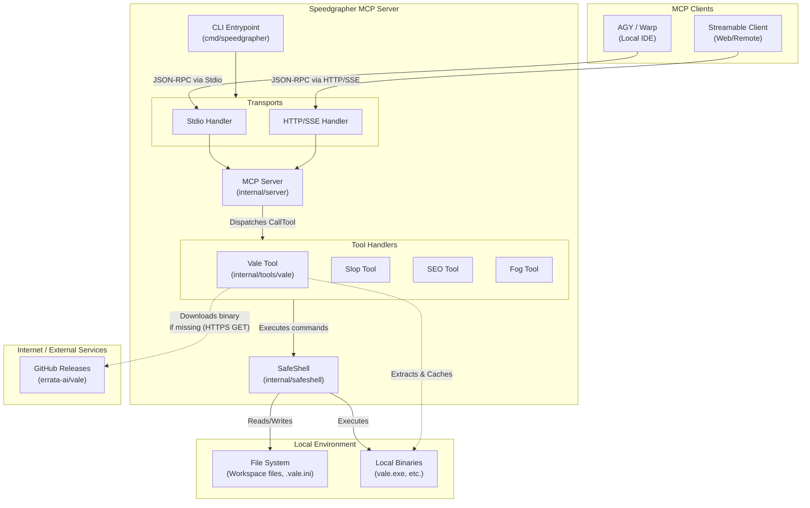
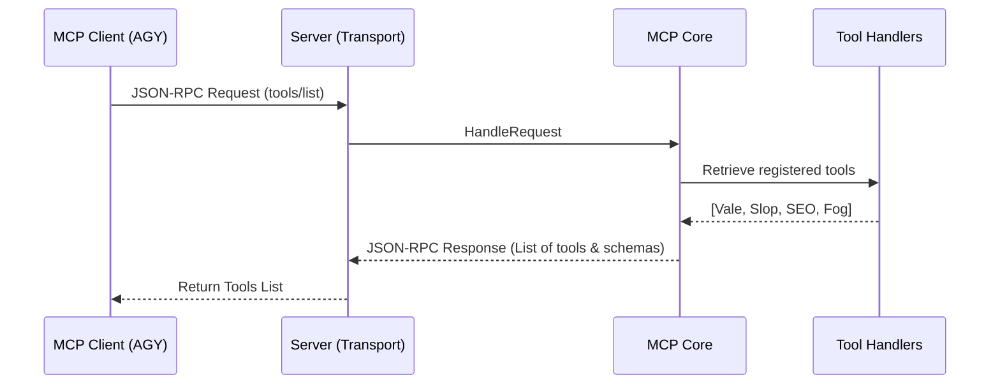
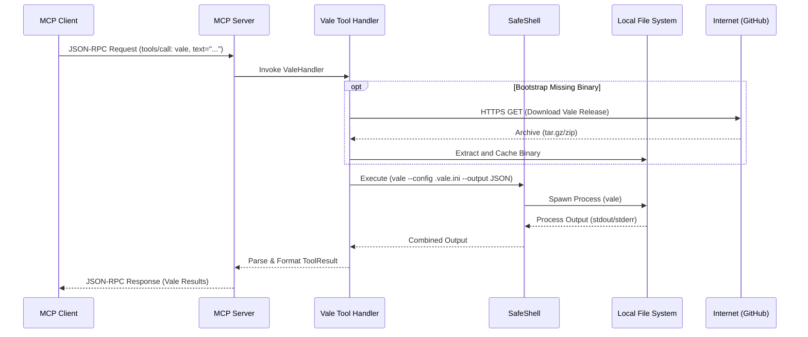
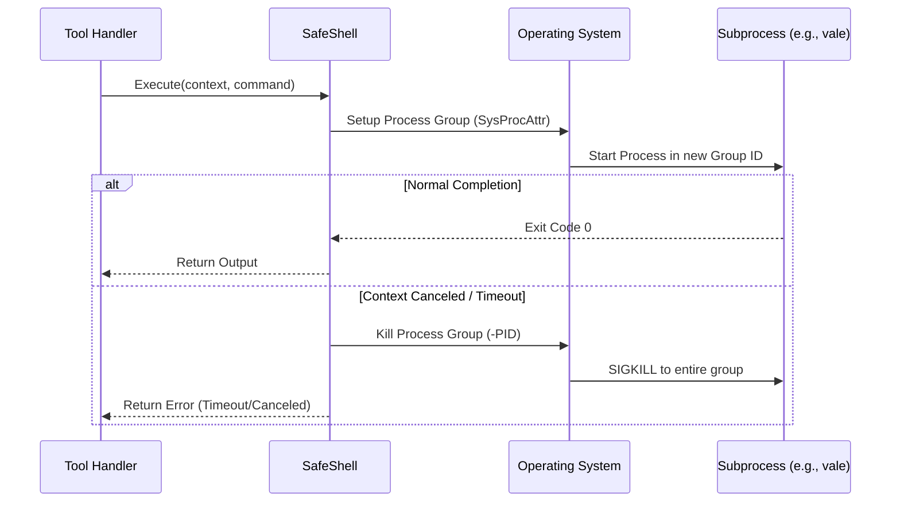

# Speedgrapher Architecture

This document provides a high-level overview of the Speedgrapher system architecture, detailing the components, data flows, external connections, and sequence views for processing requests.

## Component Overview

Speedgrapher acts as a Model Context Protocol (MCP) server, integrating external static analysis and documentation tools into AI coding clients like AGY and Streamable.

## Data Flows and Internet Connections

Speedgrapher is designed to be privacy-conscious and primarily operates locally. However, it does require some connections to the internet for bootstrapping dependencies.

**From Local Computer to the Internet:**
1. **Binary Bootstrapping (e.g., Vale):** When the server starts or a tool is invoked for the first time, the tool handler (e.g., `internal/tools/vale/bootstrap.go`) checks if the required underlying binary (like `vale`) is installed. If it is not found, Speedgrapher makes an `HTTPS GET` request to the internet (specifically `https://github.com/errata-ai/vale/releases/download/...`) to download the binary.
2. **Configuration Syncing:** Some tools may need to sync their styles or configurations (e.g., `vale sync`), which may also reach out to GitHub or configured package repositories to pull down style rules.

**Data Flow Summary:**
* **No Telemetry:** Speedgrapher itself does not send your code, prompts, or workspace data to the internet.
* **Local Processing:** All static analysis and tool execution happens strictly on your local machine via the `SafeShell` component. The tool receives the file content from the MCP client or reads it from the local filesystem, processes it through the local binary, and returns the JSON output back to the MCP client.

---

## Sequence Views

The following sequence diagrams illustrate how different use cases are processed within the Speedgrapher system.

### Use Case 1: Tool List Request (`tools/list`)

When the MCP client connects, it requests the list of available tools to understand what Speedgrapher can do.

### Use Case 2: Tool Call Execution (`tools/call`)

When the AI assistant decides to use a tool (e.g., run Vale on a markdown file).

### Use Case 3: Process Cleanup (SafeShell Isolation)

To prevent zombie processes (a known issue), SafeShell ensures that any subprocesses spawned by tools are properly terminated, even if the MCP client cancels the request or disconnects.

